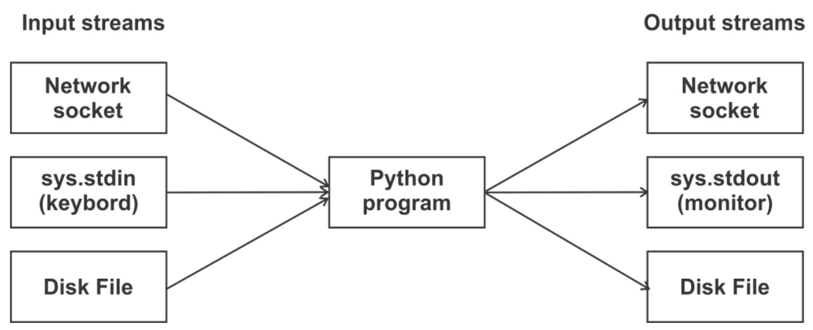

# Files, Formats, and Serialization

Before starting this Assignment, make sure to read all the required materials for this module, which can be found in the corresponding module Discussion.

## Essentials to Keep in Mind

- **_Comma Separated Values (CSV)_** format is very widely used to import and export data in spreadsheets and RDBMS tables. The csv module, another built-in module in Python’s standard library, presents the functionality to easily convert Python’s sequence object in CSV format and write to a disk file.
- **_JavaScript Object Notation (JSON)_** is an easy to use lightweight data interchange format. It is a language-independent text format, supported by many programming languages. This format is used for data exchange between the web server and clients. Python’s json module, being a part of Python’s standard distribution, provides serialization functionality similar to the pickle module.
- **_XML_** is another well-known data interchange format, used by a large number of applications. One of the main features of eXtensible Markup Language (XML) is that its format is both human readable and human readable. XML is widely used by applications of web services, office tools, and Service Oriented Architectures (SOA).

## Useful Links

- https://pandas.pydata.org/docs/index.html

## Completing the Homework

Create a `hw02` project/folder that demonstrates the following:

- Contains a Python script named `hw02.py`.
- Reads at least 10 rows of _useful_ data from a `hw02.csv` document.
- Saves the data to a `hw02.xml` file in XML format.
- Saves the data to a `hw02.json` file in JSON format.
- Leverages `pipenv` (and a `Pipfile`) to manage its dependencies.
- Does not directly copy examples from the book or class.

Save a screenshot of your app _(successfully running)_ to `screenshot.jpg` in your project folder. (You can use `WIN+SHIFT+S` for easy access to the Windows built-in screenshot tool.)

Bundle your project folder into a `bundle.docx` file by simply placing [`bundle`](https://github.com/seansbox/pybundler/raw/main/bundle.exe) in your project folder and running it. The required files, such as \*.py, Pipfile, screenshot.jpg, etc., will be automatically included. Finally, submit the `bundle.docx` file to _Canvas_.
