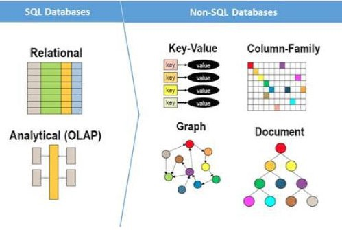

# HW05 Data Structure with No... Structure

_Before starting this Assignment, make sure to read all the required materials for this module, which can be found in the corresponding module Discussion._

## In A Nutshell

In this module, we will temporarily shift our focus from **SQL** databases to **NoSQL** databases. While SQL databases are known for their structured data storage and ACID compliance, NoSQL databases offer a more flexible and freakishly fast approach, which is advantageous in _certain_ situations.



NoSQL databases offer horizontal scalability and high availability due to their distinct architectural features compared to traditional SQL databases:

- **Horizontal scalability**: NoSQL databases are designed to scale out by adding more nodes to the system, distributing data across multiple servers. This helps in handling increased data loads and requests without incurring significant performance degradation. In contrast, SQL databases typically scale up, which requires adding more resources to a single server, such as increased CPU or memory. Scaling up can be expensive and have limitations, whereas horizontal scalability in NoSQL databases supports better handling of growing data volumes and user loads.

- **High availability**: NoSQL databases often use a distributed architecture, which means data is replicated across multiple nodes. This replication provides redundancy and ensures that even if a node fails, the data remains accessible from other nodes. Some NoSQL databases also support automatic failover and self-healing, which helps maintain system uptime and recover from failures without manual intervention. In SQL databases, achieving high availability may require more complex configurations and additional hardware or software investments, such as clustering or replication setups.

Overall, the architectural differences between NoSQL and SQL databases enable NoSQL systems to provide horizontal scalability and high availability, making them well-suited for handling _massive_ data sets and ensuring constant data access. Here are some examples where NoSQL databases might be a better choice include:

- handling social media data
- storing sensor data from IoT devices
- managing large-scale content management systems

As SQL is still the more commonly used architecture for most use cases, this course won't dive as deeply into NoSQL. However, it's important to take away an understanding of when and how to use NoSQL databases in real-world applications.

In Chapter 11, the focus is around:

- **NoSQL databases**: Understanding the difference between SQL and NoSQL databases, their use cases, and advantages.
- **MongoDB**: Introduction to MongoDB, a popular NoSQL database, its basic concepts, and how to install and configure it.
- **PyMongo**: Learn how to interact with MongoDB using Python and the PyMongo library, including creating, querying, updating, and deleting documents in a collection.
- **MongoDB relationships**: Understand different ways to model relationships in MongoDB, such as embedding and referencing documents.

In Chapter 12, the focus is around:

- **Cassandra**: Introduction to Apache Cassandra, a highly scalable and distributed NoSQL database system, and its architecture.
- **Installation and configuration**: Learn how to install and configure Cassandra on your local machine.
- **CQL Shell**: Understand the basics of the Cassandra Query Language (CQL) shell and how to use it to interact with the database.
- **Cassandra data modeling**: Learn about keyspace, partition key, clustering key, and compound partition key.
- **Python Cassandra Driver**: Discover how to use the Python Cassandra driver to interact with the database, including connecting to the database, querying tables, and using user-defined types.

We'll focus on MongoDB for the homework. Unlike SQLite that can operate directly on a `.sqlite3` file with no server running, most all SQL and NoSQL implementations require a server to be running. So we'll need to **install MongoDB locally** and ensure it is running properly. Lucky for us, it's freeee, and we already did it! We installed MongoDB using PowerShell (as Administrator) in module 01 when we ran something like this:

    choco install mongodb

Now, we need to make sure that server is actually **running**. We can do this by running the following command in PowerShell (as Administrator):

    net start MongoDB

We should now be up and running. Let's get out of PowerShell, and **create a new hw05 project**. We'll use the **pymongo** library to interact with the server from Python.

    pipenv install pymongo

Now we can write a simple Python script that interacts with MongoDB!

```
import pymongo

# Connect to MongoDB
client = pymongo.MongoClient("mongodb://localhost:27017/")
db = client["mydatabase"]
collection = db["mycollection"]

# Create a document
doc = {"name": "Alice", "age": 30}

# Insert the document
result = collection.insert_one(doc)
print(f"Inserted document with ID: {result.inserted_id}")

# Find the document
doc = collection.find_one({"name": "Alice"})
print(doc)

# Update the document
result = collection.update_one({"name": "Alice"}, {"$set": {"age": 31}})
print(f"Updated {result.modified_count} documents")

# Delete the document
result = collection.delete_one({"name": "Alice"})
print(f"Deleted {result.deleted_count} documents")
```

## Additional Reading

- [NoSQL Databases: An Overview](https://www.ibm.com/cloud/learn/nosql)
- [A Comparison of NoSQL DBMS and Models](https://www.digitalocean.com/community/tutorials/a-comparison-of-nosql-database-management-systems-and-models)
- [MongoDB Query Selectors](https://www.mongodb.com/docs/manual/reference/operator/query/#std-label-query-selectors)
- [PyMongo Collection API](https://pymongo.readthedocs.io/en/stable/api/pymongo/collection.html)
- [AWS Database Services](https://aws.amazon.com/products/databases/)

## How to 'MongoDB' from the command-line

    mongo
    > db
    > use movies
    > db.movies.insert({ "name": "The Wizard of Oz", "release": new Date("1939-08-25"), "thumb": "https://resizing.flixster.com/ulqUDhVVuKGWDLeBtkp9KjyReo8=/206x305/v2/https://flxt.tmsimg.com/NowShowing/129612/129612_ab.jpg", "summary": "When a tornado rips through Kansas, Dorothy (Judy Garland) and her dog, Toto, are whisked away in their house to the magical land of Oz. They follow the Yellow Brick Road toward the Emerald City to meet the Wizard, and en route they meet a Scarecrow (Ray Bolger) that needs a brain, a Tin Man (Jack Haley) missing a heart, and a Cowardly Lion (Bert Lahr) who wants courage. The wizard asks the group to bring him the broom of the Wicked Witch of the West (Margaret Hamilton) to earn his help.", "meter": 98, "score": 89 })
    > show dbs
    > db.movies.find({ meter: { $gt: 80 } })
    > db.movies.updateMany({ name: "The Wizard of Oz" }, { $set: { meter: 100 } })
    > db.movies.updateMany({ name: "The Wizard of Oz" }, { $inc: { meter: 100 } })
    > db.movies.deleteMany({ name: "The Wizard of Oz" })

## How to 'MongoDB' in Python

    poetry config virtualenvs.in-project true
    poetry init -n
    code .
    poetry add pymongo
    (build your hw05.py file)
    poetry run python hw05.py

# Completing the Homework

Create a `hw05` project/folder that demonstrates the following:

- Meets the technical requirements outlined below:
  - Includes `pymongo` as a dependency using `pipenv`.
  - Connects to a local MongoDB server using PyMongo.
  - Designs a schema for a `book` collection where each book document contains the following fields:
    - `title` (string)
    - `author` (string)
    - `publication_year` (integer)
    - `genre` (string)
    - `copies` (integer)
  - Interacts with the collection using `CRUD` operations:
    - **Create:** Inserts three books into the collection with the schema defined above.
    - **Read:** Retrieves all books in the collection and prints their information.
    - **Update:** Updates one of the books by either changing its title, author, publication year, genre, or the number of copies.
    - **Delete:** Deletes one of the books from the collection.
- Leverages pipenv (and a Pipfile) to manage its dependencies.
- Includes a screenshot.jpg of the app successfully running. (You can use `WIN+SHIFT+S` for easy access to the Windows built-in screenshot tool.)
- Does not directly copy examples from the book or class.

Bundle your project folder into a `bundle.docx` file by simply placing [`bundle`](https://github.com/seansbox/pybundler/raw/main/bundle.exe) in your project folder and running it. The required files, such as \*.py, Pipfile, screenshot.jpg, etc., will be automatically included. Finally, submit the `bundle.docx` file to _Canvas_.
